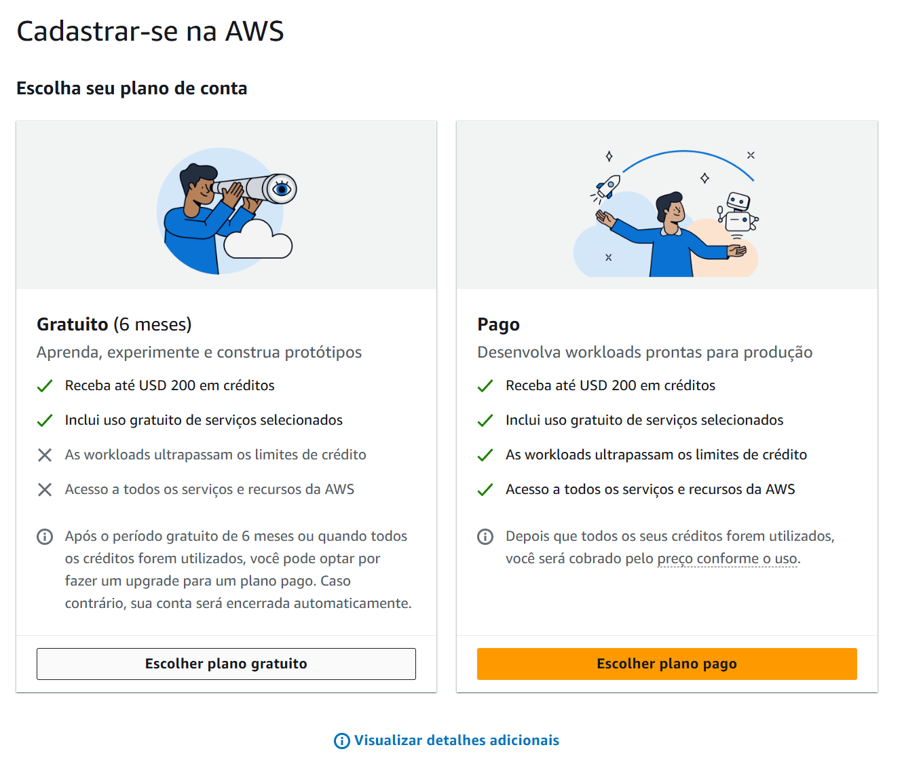
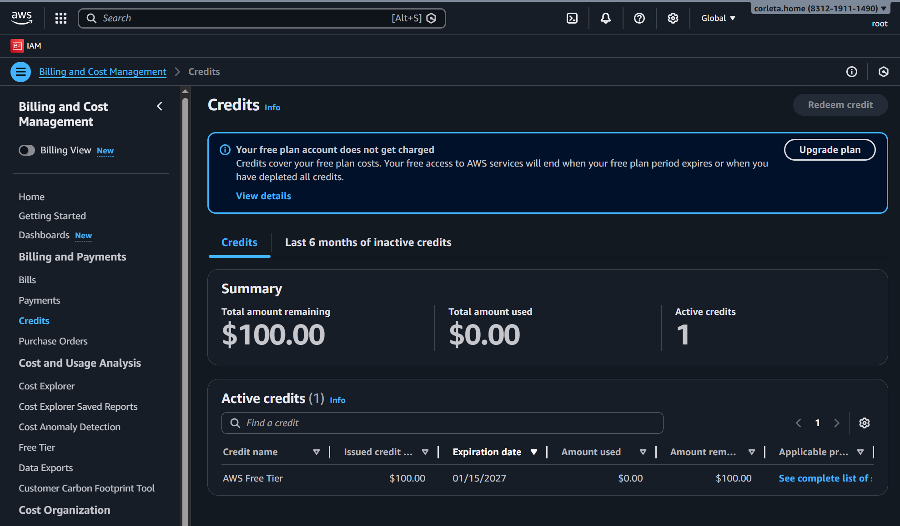
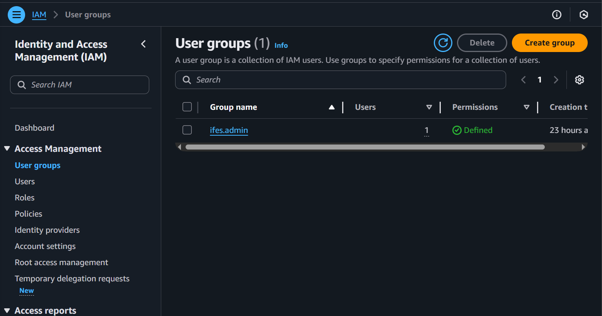
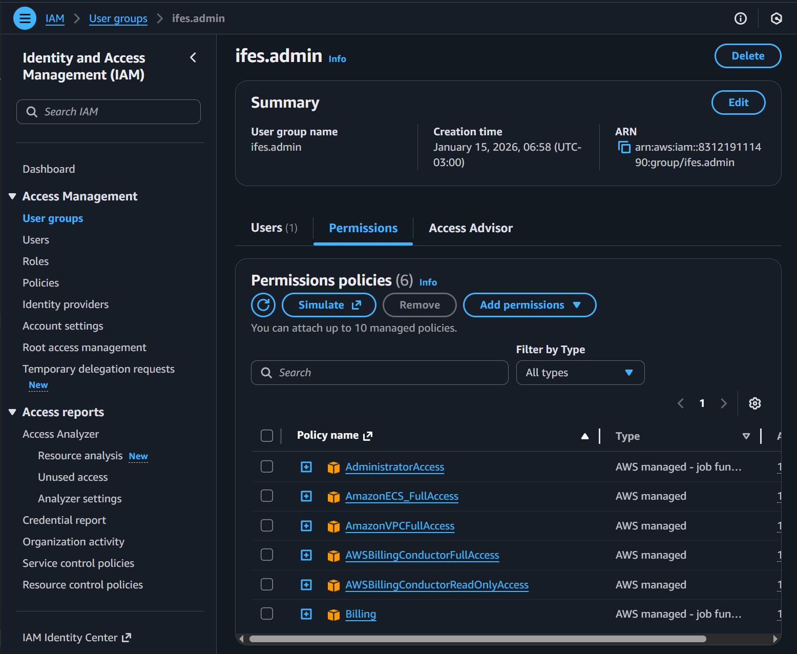

# Sobre o uso da AWS para práticas

## Free Tier

- [Explore AWS services with AWS Free Tier](https://docs.aws.amazon.com/awsaccountbilling/latest/aboutv2/free-tier.html)
- [Track your Free Tier usage for Amazon EC2](https://docs.aws.amazon.com/AWSEC2/latest/UserGuide/ec2-free-tier-usage.html)


## Qual conta estou usando?

Eu criei uma conta no Console AWS com meu email pessoal e selecionei o plano gratuito na AWS. Você terá **$100.00** de crédito para usar que expiram depois de muito tempo. 

<p align="center"><br><em>Planos na hora de se cadastrar na AWS</em></p>

Quando acessar pela primeira vez, será com a credencial de **root**, que não deve ser utilizada para nenhuma forma de implementação. Prossiga criando um usuário no serviço **IAM** e dê as permissões devidas a ele.

Você pode ver isso acessando com as credenciais de **root** e navegando até `Billing and Cost Management > Credits`.

<p align="center"><br><em>Demonstração de créditos na AWS</em></p>


## Atributa as permissões ao seu usuário


<p align="center"><br><em>Grupo criado</em></p>


<p align="center"><br><em>Políticas atribuídas ao Grupo</em></p>

##  Configuração das credenciais AWS

Antes de usar o Terraform, o AWS CLI precisa saber qual credencial usar. Se navegar até `IAM > Security credentials`, poderá criar o tipo de credencial **Access keys**, para o *use case* **Command Line Interface (CLI)**. Você deve manter um arquivo próprio contento as credenciais `accessKeys` neste projeto, assim: `.aws/credentials`. O padrão é:

```ini
[default]
aws_access_key_id = SUA_KEY
aws_secret_access_key = SUA_SECRET
```

Como esse arquivo não está no local padrão do AWS CLI, é obrigatório informar manualmente onde ele está. Isso é feito com a variável de ambiente: `AWS_SHARED_CREDENTIALS_FILE`. Essa variável é usada pelo AWS CLI e ao Terraform:   **“Use este arquivo aqui como origem das credenciais.”**

> **NOTA:** Ela vale apenas no terminal e no diretório onde foi criada. Se você abrir outro terminal ou sequer trocar de diretório, ela perderá efeito.

```bash
cd k8s-lab-1-aws/terraform
export AWS_SHARED_CREDENTIALS_FILE="../../.aws/credentials"
```

Verifique se o AWS CLI está lendo esse arquivo corretamente:

```bash
aws sts get-caller-identity
```
Isso deve produzir a seguinte saída:

```json
{
    "UserId": "<User ID>",
    "Account": "<Account Number>",
    "Arn": "<Arn da Identidade>"
}
```

> ⚠️ **ATENÇÃO**: se você tem a prática de utilizar AWS CLI, avalie bem o retorno do sts para ter certeza de estar apontando para account correta. A depender das permissões que você tiver, a partir de agora criará diversos recursos na AWS.