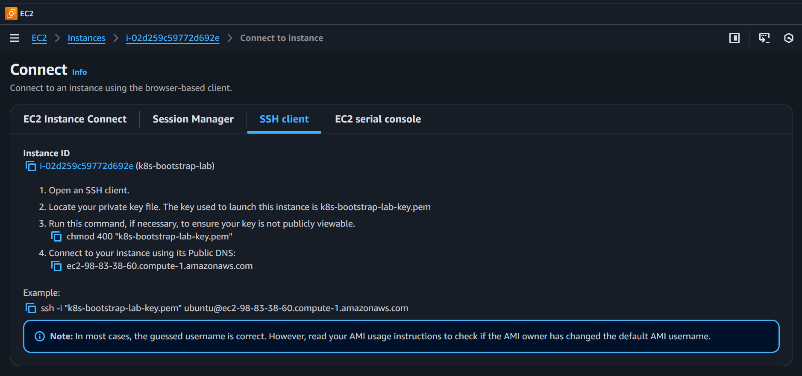

# Passo a passo

> **NOTA.:** O `.gitignore` está ignorando muitos recursos que serão criados aqui. Assim, não estranhe se eles não aparecerem em seu repositório remoto.

## 0 – Configuração das credenciais AWS

Antes de usar o Terraform, o AWS CLI precisa saber qual credencial usar. Este projeto mantém um arquivo próprio:

```bash
.aws/credentials
```

Com o formato:

```ini
[default]
aws_access_key_id = SUA_KEY
aws_secret_access_key = SUA_SECRET
```

Como esse arquivo não está no local padrão do AWS CLI, é obrigatório informar manualmente onde ele está. Isso é feito com a variável de ambiente: `AWS_SHARED_CREDENTIALS_FILE`. Ela simplesmente diz: **"Use este arquivo de credenciais aqui."**

Ela diz ao AWS CLI e ao Terraform:   **“Use este arquivo aqui como origem das credenciais.”**

> **NOTA:** Ela vale apenas no terminal e no diretório onde foi criada. Se você abrir outro terminal ou sequer trocar de diretório, ela perderá efeito.

```bash
cd aws-k8s-lab-1/terraform
export AWS_SHARED_CREDENTIALS_FILE="../../.aws/credentials"
```

Verifique se o AWS CLI está lendo esse arquivo corretamente:

```bash
aws sts get-caller-identity
```
Isso deve produzir a seguinte saída:

```json
{
    "UserId": "AROAZQ3DR3MJGLRDCXV2G:user2467982=Matheus_",
    "Account": "654654429970",
    "Arn": "arn:aws:sts::654654429970:assumed-role/voclabs/user2467982=Matheus_"
}
```

> **ATENÇÃO**: confira o caminho assumido `/voclabs/`. Se você usa AWS CLI para outras contas, é bem fácil confundir o terminal e mandar o Terraform criar recursos no lugar errado.


## 1 – Criação da chave SSH local

Gerar o par de chaves que será usado para acesso SSH à instância EC2:

```bash
ssh-keygen -t ed25519 -f .aws/ec2-keys/k8s-bootstrap-lab-key.pem
```

Isso cria dois arquivos:

- aws/ec2-keys/k8s-bootstrap-lab-key → chave privada (fica somente na máquina local)
- aws/ec2-keys/k8s-bootstrap-lab-key.pub → chave pública (usada pelo Terraform para criar o key pair na AWS)

## 2 – Provisionar a instância EC2 com Terraform

Dentro da pasta do projeto Terraform (aws-k8s-lab-1/terraform):

Inicializar o Terraform:
```bash
terraform init
```

Não coloque nenhuma frase nem nada, só dê enter 'vazio' em tudo.

Ver o plano:
```bash
terraform plan
```

Aplicar:
```bash
terraform apply
```

Depois, acessar via SSH:
```bash
ssh -i aws/ec2-keys/k8s-bootstrap-lab-key ubuntu@<IP_PUBLICO_EC2>
```

## 3 — Configurar a instância EC2 para virar o "Bootstrap Cluster"

`Bootstrap Cluster` é o nome dado ao cluster que tem a capacidade de criar outros clusters, isto é, ele serve para fazer o bootstrap de outros. Ele não serve para outras questões. Comumente, o que se faz é instalar uma versão reduzida do k8s só para instalar a camada do CAPI em cima. 

Entre ma máquina:

```bash
cd cd .aws/ec2-keys/
ssh -i "k8s-bootstrap-lab-key.pem" ubuntu@ec2-98-83-38-60.compute-1.amazonaws.com
```

> **NOTA.:** essa parte `ubuntu@ec2-98-83-38-60.compute-1.amazonaws.com` é dinâmica e atribuída pela AWS. É um hostname. 

<p align="center"><br><em>onde encontrar o SSH de conexão no EC2</em></p>