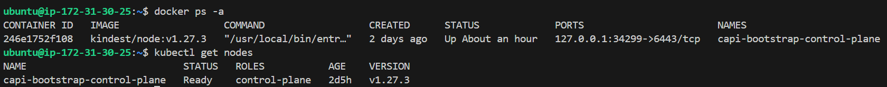

# Short Answer Questions

## O que é o `kind`?

o `Kind` não é o `control-plane`, ele só te dá um cluster Kubernetes descartável (o bootstrap cluster). Dentro dele você instala os controladores do Cluster API (CAPI). Esses controladores, sim, vão orquestrar a criação de um novo control-plane real (com etcd, kube-apiserver, etc.) nos nós que você indicar. 

Então: Kind = bootstrap cluster; nele roda o CAPI; o CAPI cria e gerencia o control-plane e os workers “de verdade”.

## O que é o `clusterctl`?

O clusterctl é um CLI oficial do Cluster API. Ele serve para inicializar o CAPI dentro de um cluster de bootstrap (ex: Kind), além de gerar manifestos e gerenciar upgrades dos componentes do CAPI.

## O que acontece quando você reinicia a instancia EC2?

É muito o EC2 trocar o IP interno da máquina. Oque acontece? a instancia é trocada? a infra é outra? o EC2 drena? Zonas de disponibilidade.

Após ter configurado a máquina eu a reinicializei. Com os comandos abaixo constatei que estava tudo em pé:

##  Porque `k8s` é melhor que `IaC` convencional?

Agora, por que isso seria diferente de um IaC tradicional (Terraform/CloudFormation)?

1) Reconciliação contínua, não ação pontual

- No Kubernetes, um controlador fica rodando em loop infinito garantindo que o estado real combine com o estado desejado que você declarou.
- Se alguém apagar um load balancer criado via CRD, o controlador recria.
- Se mudar uma subnet sem querer, ele corrige.
- IaC tradicional (Terraform/CloudFormation) só age quando você manda.
- Se o estado muda depois, paciência.

2) Tudo vira parte do ecossistema do cluster

Com CRDs, recursos de infraestrutura entram no mesmo fluxo do Kubernetes:
- RBAC, eventos, anotação, logs, conditions, kubectl describe, tudo.
- É um modelo unificado.
- IaC vive fora do cluster, com outro conjunto de ferramentas e outro ciclo de vida.

3) Integração com automação nativa do Kubernetes

- Controllers usam o mesmo motor de reconciliação de Deployments, Ingress, Services, etc.
- O cluster reage automaticamente a mudanças, falhas e atualizações.
- IaC não reage — ele só aplica. Qualquer reação precisa ser programada fora.

##  Porque eu iria querer transformar máquinas em providers?

1) Reaproveitar máquina ociosa → Se a empresa tem desktop parado, servidor velho ou laboratório subutilizado, você transforma tudo isso em “nós” baratos para clusters provisórios.

2) Testar cenários híbridos → Você consegue criar clusters que misturam AWS com hardware local, simulando edge, filiais, chão de fábrica e ambientes restritos.

3) Padronizar o ciclo de vida de máquinas internas → Com CAPI + provider local, qualquer máquina vira “infra declarada”: nasce, morre, atualiza e escala a partir de YAML, igual nuvem.

4) Garantir reconciliação contínua → Se um PC falha, formata, troca de disco ou reinicia, o CAPI simplesmente recria a máquina ou reconfigura ela. Mano, isso é ouro em ambiente físico.

5) Treinar times sem pagar nuvem → Você cria clusters inteiros para ensino, CI, experimentos e PoCs sem gastar um centavo com EC2, EKS e VPC.

## Por que o paradigma de microsserviços?

## Por que contêineres?

## De onde veio Gollang?