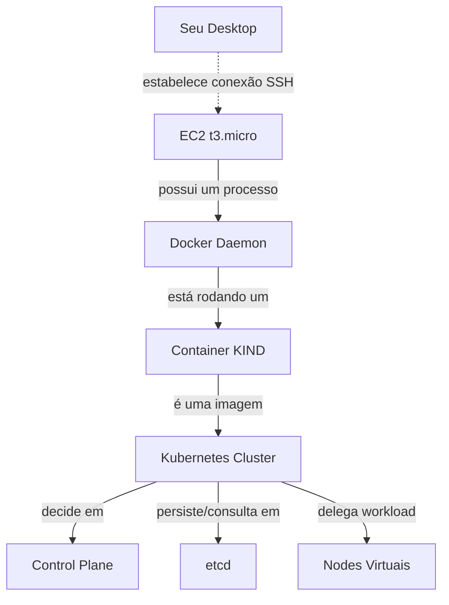
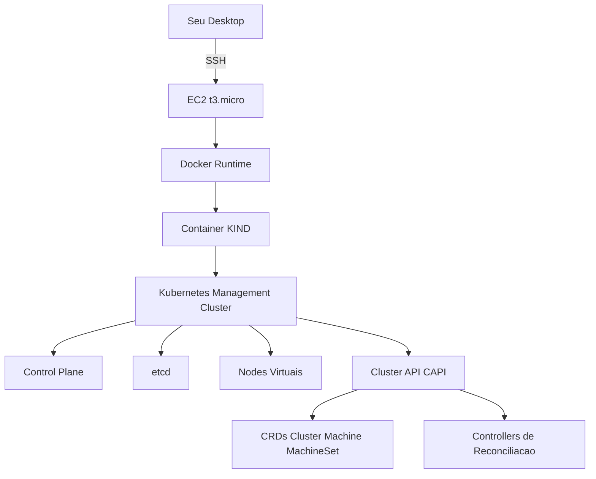
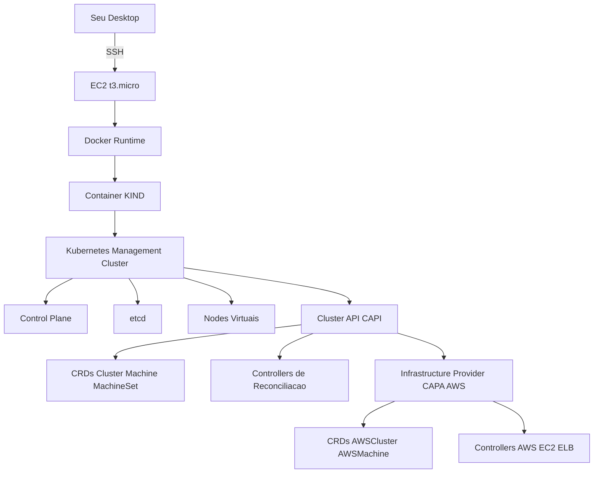
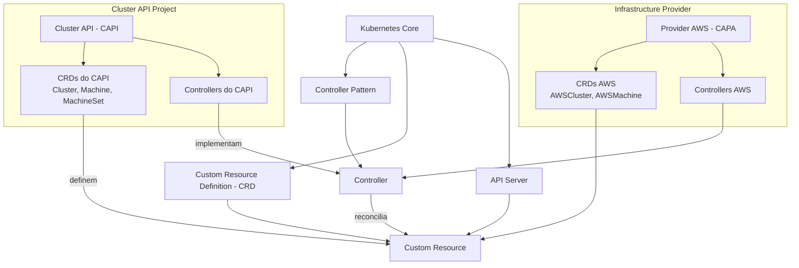

# Passo a passo para prática de provisionar k8s com CAPI na AWS

**OBJETIVO**: instanciar uma máquina EC2 na AWS e executar nela um cluster Kubernetes via kind, utilizado como management cluster para trabalhar com CRDs do Cluster API (CAPI).

**FERRAMENTAS** : Para isso usaremos `terraform` para provisionar e configurar recursos rapidamente, `ssh-keygen` para gerar chaves *ssh*, `AWS CLI` para dar comandos à AWS e `OpenSSH` como cliente *ssh* para se conectar ao EC2.

## 1 – Criação da chave SSH local

O `terraform` é um utilitário de linha de comando usado para configurar e provisionar recursos de forma declarativa. Entretanto, essa CLI não oferece suporte a download. Ou seja, é possível usá-lo para criar uma chave de acesso SSH para uma instância EC2, mas a ferramenta não a baixa automaticamente, o que torna o processo inútil nesse contexto.

Então, vamos gerar o par de chaves localmente e exportá-lo para uso no EC2. Usando o utilitário `ssh-keygen`, normalmente disponível em sistemas Unix, geraremos as chaves que serão usadas para acesso SSH à instância EC2. Por favor, **navegue até a raiz do projeto** e dê o seguinte comando — obs.: não utilize nenhuma `passphrase`:

```bash
ssh-keygen -t ed25519 -f .aws/ec2-keys/k8s-bootstrap-lab-key.pem
```
Isso cria dois arquivos:
- aws/ec2-keys/k8s-bootstrap-lab-key.pem        → chave privada (fica somente na máquina local)
- aws/ec2-keys/k8s-bootstrap-lab-key.pem.pub    → chave pública (enviada à AWS para compor o Key Pair)

Não coloque nenhuma frase nem nada, só dê enter 'vazio' em tudo.

## 2 – Provisionar a instância EC2 com Terraform

Agora navegue até a pasta *k8s-lab-1-aws/terraform*. Nessa pasta, preciso que faça a [Configuração das credenciais AWS](../.aws/README.md#configuração-das-credenciais-aws).

Inicializar o Terraform:
```bash
terraform init
```

Ver o plano:
```bash
terraform plan
```

Aplicar:
```bash
terraform apply
```

É importante, após as práticas, remover toda a infraestrutura criada para evitar custos desnecessários. Isso pode ser feito com o comando abaixo. Atenção: ele remove **todos** os recursos gerenciados pelo Terraform no diretório atual. Tudo o que foi criado a partir da seção 3 será apagado.

```bash
terraform destroy
```


## 3 — Acessar e Configurar a instância EC2

Para acessar a instância criada, você pode ir até `EC2 > Instances > **id_sua_instancia** > Connect to instance`. Verá um Exemplo de comando de conexão ssh, algo assim: `ssh -i "k8s-bootstrap-lab-key.pem" ubuntu@ec2-34-201-148-231.compute-1.amazonaws.com`. 

<p align="center"><br><em>Onde encontrar o SSH de conexão no EC2</em></p>

> 🔎 **NOTA** : a parte *ubuntu@ec2-34-201-148-231.compute-1.amazonaws.com* é dinâmica e atribuída pela AWS, pois está vinculada ao IP público da instância. Ela muda quando a instância é **parada** e **iniciada** novamente (ou **recriada**).

Eu irei criar uma variável essa parte dinâmica, porque assim fica mais fácil para eu trabalhar.

```bash
export EC2_HOST=ubuntu@ec2-34-201-148-231.compute-1.amazonaws.com
ssh -i .aws/ec2-keys/k8s-bootstrap-lab-key.pem $EC2_HOST
```

Daí, faça as coisas coisas triviais:

> 🔎 **NOTA** : como opção, eu implementei um script de configuração da instância e você pode saber como usa-lo em [Configure sua Máquina com um Script](bootstrap.md#configure-sua-máquina-com-um-script) — mas recomendo que faça manualmente pelo menos uma vez para saber o que está rolando.

1. Atualizar o sistema e instalar algumas coisas:
```
sudo apt update && sudo apt upgrade -y
```

2. **Instalar Docker** (Kind precisa disso):
```bash
sudo apt install -y docker.io        # Instala o Docker a partir dos repositórios da distribuição
sudo systemctl enable --now docker   # Habilita o serviço do Docker e inicia imediatamente
sudo usermod -aG docker ubuntu       # Adiciona o usuário 'ubuntu' ao grupo docker para executar comandos sem sudo
newgrp docker                        # Recarrega os grupos do usuário e aplica o acesso ao Docker.
``` 

> 🔎 **NOTA** : Aqui é bom entrar e sair de novo da conexão SSH, para forçar as permissões. Dê o comando `exit` e depois acesse a instância novamente.

3. **Instalar Kind**

O Kind é `Kubernetes In Docker`, ele será no nosso `Bootstrap Cluster` — nome dado ao cluster que tem a capacidade de criar outros clusters, isto é, ele serve para *fazer o bootstrap* de outros. A prática é instalar uma versão reduzida do *k8s*. O *Kind* serve a esse propósito.

```bash
# Baixa o binário do KIND (Kubernetes in Docker) para Linux
curl -Lo kind https://kind.sigs.k8s.io/dl/v0.20.0/kind-linux-amd64

# Torna o arquivo baixado executável
chmod +x kind

# Move o binário para um diretório presente no PATH do sistema
# para que o comando 'kind' possa ser executado de qualquer lugar
sudo mv kind /usr/local/bin/

# Verifica se o KIND foi instalado corretamente e exibe a versão
kind --version
```

4. **Instalar kubectl**

`kubectl` é só o cliente que fala com o Kubernetes, é um CLI.

```bash
# Baixa a versão estável mais recente do kubectl para Linux (amd64)
curl -LO "https://dl.k8s.io/release/$(curl -L -s https://dl.k8s.io/release/stable.txt)/bin/linux/amd64/kubectl"

# Torna o binário do kubectl executável
chmod +x kubectl

# Move o kubectl para um diretório presente no PATH do sistema
# permitindo executar o comando de qualquer lugar
sudo mv kubectl /usr/local/bin/

# Verifica se o kubectl foi instalado corretamente
# e exibe a versão do cliente
kubectl version --client
```

5. Criar o cluster Kind que será o management cluster
```bash
# Cria um cluster Kubernetes local usando KIND
# O cluster será executado dentro de containers Docker e receberá o nome 'capi-mgmt'
kind create cluster --name capi-mgmt

# Lista os Nodes registrados no cluster recém-criado
# permitindo verificar se o control plane está ativo
kubectl get nodes
```

## 4 — Inicialização do Cluster API no cluster de gerenciamento (Kind)

Ta, agora eu vou explicar onde você está neste momento de uma forma mais ou menos visual:

```bash
Seu Desktop # Sua máquina local.
   .
   .
   .   (conexão SSH)
   .
   .
EC2 (t3.micro)
# Uma máquina virtual fornecida pela AWS.
# Para todos os efeitos, é um computador remoto rodando Linux.
# Tudo o que vem abaixo depende dela estar ligada.

└── Docker
    # Um programa que roda continuamente nessa máquina (um daemon).
    # Ele permite executar aplicações isoladas chamadas containers.
    # Esses containers compartilham o kernel da EC2, mas têm processos,
    # rede e filesystem isolados.

    └── Container KIND
        # Um container criado pelo Docker.
        # Ele não é o Kubernetes em si.
        # Ele existe para CRIAR e HOSPEDAR um cluster Kubernetes usando containers.
        # Pense nele como um "ambiente controlado" onde o Kubernetes vai rodar.

        └── Kubernetes
            # Agora sim, o sistema Kubernetes.
            # Ele é composto por vários processos que, juntos,
            # formam um cluster capaz de gerenciar aplicações distribuídas.

            ├── control-plane
            # NÃO é um node de execução.
            # É o conjunto de componentes que controlam o cluster.
            # Ele:
            # - recebe comandos do usuário (kubectl → API Server)
            # - decide em qual node cada aplicação deve rodar (Scheduler)
            # - garante que o estado desejado seja mantido (Controllers)
            # Sem o control-plane, o cluster não toma decisões.

            ├── etcd
            # O banco de dados do Kubernetes.
            # Ele armazena o estado atual e desejado do cluster.
            # O control-plane consulta e atualiza o etcd o tempo todo.
            # Se o etcd é perdido, o cluster perde sua memória.

            └── nodes (virtuais)
            # São os locais onde as aplicações realmente rodam.
            # Do ponto de vista do Kubernetes, são máquinas.
            # Neste caso, são apenas containers Docker simulando máquinas.
            # É neles que os pods são executados.

```

Em um desenho mais visual ficaria assim:




Agora, você vai adiconar mais uma camada de abstração de software em cima disso kkk ... é o tal do **Cluster API** e assim teremos a seguinte estrutura:





Para ter o CAPI, o caminho mais fácil é instalar o `clusterctl`. Ele é só um CLI que irá trocar uma ideia com o k8s dentro do container e pedir para instalar o CAPI.

```bash
# Baixa o binário do clusterctl (CLI do Cluster API) direto do GitHub
curl -L https://github.com/kubernetes-sigs/cluster-api/releases/download/v1.7.2/clusterctl-linux-amd64 -o clusterctl

# Torna o arquivo executável
chmod +x clusterctl

# Move o binário para um diretório do PATH
# Assim o comando `clusterctl` pode ser executado de qualquer lugar
sudo mv clusterctl /usr/local/bin/
```

> 🔎 **NOTA** : `kubectl` é o cliente genérico do Kubernetes, operado em CLI. Fala com o API Server. Cria, lê e altera recursos Kubernetes. Inclui CRDs do CAPI, mas não sabe inicializar nada. Já o `clusterctl` é o cliente específico do Cluster API, operado em CLI. Ele instala os CRDs do CAPI, instala providers (que é uma coisa que ainda não discutimos) e valida versões e compatibilidade. É tipo um instalador, depois que usar ele pode voltar a usar kubectl.

> ⭐ **CONCEITO IMPORTANTE**:
Ao adicionar CRDs e controllers ao Kubernetes, você amplia o escopo do que ele consegue gerenciar. O Kubernetes deixa de orquestrar apenas aplicações (pods, services, deployments) e passa a atuar como um plano de controle capaz de declarar, criar e manter recursos **de cloud** utilizados por essas aplicações.

Mas antes, os controllers do Cluster API com provider AWS (CAPA) vão rodar dentro da EC2 e precisam criar recursos na AWS. Para isso, eles precisam de credenciais válidas da AWS. Como você sabe, essas credenciais existem no seu desktop e não existem no EC2. Logo, você precisa colocar lá.

Então, volte na raiz do nosso projeto e dê os seguintes comandos:

```bash
# Acessa a EC2 via SSH
# Cria o diretório ~/.aws
# Esse é o local padrão onde ferramentas e SDKs da AWS procuram credenciais
ssh -i .aws/ec2-keys/k8s-bootstrap-lab-key.pem ubuntu@ec2-< DIFERENTE >.compute-1.amazonaws.com "mkdir -p ~/.aws"

# Copia o arquivo credentials do seu desktop
# Envia para a EC2
# Coloca exatamente no caminho esperado pelas ferramentas da AWS
scp -i .aws/ec2-keys/k8s-bootstrap-lab-key.pem .aws/credentials ubuntu@ec2-< DIFERENTE >.compute-1.amazonaws.com:~/.aws/credentials
```

Agora sim, dentro da instância, faça isso:

```bash
# Lê o arquivo de credenciais da AWS. Codifica em base64
# Exporta como variável de ambiente para o clusterctl usar
export AWS_B64ENCODED_CREDENTIALS=$(base64 -w0 ~/.aws/credentials)

# Inicializa o Cluster API no cluster Kubernetes atual
# Instala CRDs do CAPI
# Instala controllers
# Instala o provider de infraestrutura da AWS (CAPA)
clusterctl init --infrastructure aws

# Lista todos os pods em todos os namespaces
# Usado aqui para verificar se os controllers do CAPI/CAPA estão rodando
kubectl get pods -A

# Lista os CRDs instalados no cluster
# Filtra para mostrar os recursos relacionados ao Cluster API
kubectl get crds | grep cluster
```

Na prática, seu EC2 agora é oficialmente um “orquestrador de clusters Kubernetes e infraestrutura cloud” e nosso desenho mental ficou maior:




## 5 - Pausa do café: Uma conversa sobre a Infra que você criou.

Com isso, você instalou uma cama extra em cima do CAPI (*Cluster API*), você instalou o CAPA (*Cluster API Provider AWS*), que dá ao CAPI o poder de criar recursos na AWS. Existem várias 'entidades' nesse universo, vários nomes que as vezes a gente não entender bem o que são. Aqui vai um desenho para te ajudar.



Eu penso que agora precisamos discutir com muita clareza o **que você consegue fazer**, o poder que isso te deu.


## 6 — Criar o Workload Cluster via CAPI

Definir variáveis do provider AWS
Essas variáveis são consumidas pelo clusterctl e pelos controllers do CAPA.
```bash
export AWS_REGION="us-east-1"
export AWS_SSH_KEY_NAME="k8s-bootstrap-lab-key"
export AWS_CONTROL_PLANE_MACHINE_TYPE="t3.medium"
export AWS_NODE_MACHINE_TYPE="t3.medium"
```

Declarar o cluster (infraestrutura desejada)
Para o apply dos manifests dentro do cluster de gerenciamento.
Aqui você declara estado, não cria recursos manualmente.
```bash
clusterctl generate cluster meu-cluster --kubernetes-version v1.28.5 | kubectl apply -f -
```

Acompanhar a reconciliação do cluster
Esses comandos mostram o CAPI materializando a infraestrutura na AWS.
Quer ver se ele já começou? Roda:

```bash
kubectl get clusters
kubectl get awsclusters
kubectl get machines
kubectl get awsmachines
```

## 7 — Acessar o Workload Cluster

## 8 — Validar o Kubernetes do Workload Cluster

## 9 — Provisionar Workload Canônico